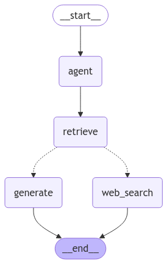

# Chatbot with RAG and Web Search

## Overview

This project implements a chatbot using a Retrieval-Augmented Generation (RAG) framework powered by LangGraph. The chatbot can retrieve information from a knowledge graph based on the [RuBQ 2.0 dataset](https://github.com/vladislavneon/RuBQ) and perform web-based queries.

<div align="center"> 
    
</div>


## Features

- **RUBQ Knowledge Graph Retrieval:** Answer questions based on the RuBQ dataset.
- **Web Search Integration:** Query real-time web-based data using the Tavily search engine.
- **Context Memory:** Handle follow-up questions by maintaining conversational context.
- **Local LLM Support:** Use a local large language model (LLAMA) for response generation.
- **Gradio Session Versatility**: Open multiple Gradio chatbots in different tabs to maintain distinct conversation threads with memory.

## How to Run

1. **Clone the Repository**

   ```bash
   git clone git@github.com:grokhi/chatbot-rag.git
   cd chatbot-rag
   ```

2. **Start the Application**

   Use Docker to build and run the services:

   ```bash
   docker-compose up
   ```

   **Note:** The first startup will pull and initialize the LLAMA model, which may take some time.

3. **Access the Chatbot**

   Open a web browser (preferably Chrome) and navigate to:

   ```
   http://localhost
   ```

   Interact with the chatbot from this interface. Please wait while local LLM will be downloaded.

## Example Questions

Here are some examples to test the chatbot's retrieval and context capabilities:

### Knowledge Graph Retrieval (RuBQ)

```text
> Какая столица у Туркмении?  # Checks RuBQ retrieval
> А у Удмуртии?              # Tests context memory for follow-up questions
```

### Web Search Queries

```text
> What is the weather in SF?  # Checks web search functionality
> What about NY?              # Tests context memory for follow-up questions
```

### Mixed query

```text
> Какая столица у Туркмении?  # Столицей Туркмении является Ашхабад
> What about NY?              # The capital of New York State is Albany.
```

## Notes and Known Limitations

- **Local LLM Performance:** Due to hardware limitations (e.g., a Dell 5587 with NVIDIA GeForce GTX 1060 Max-Q), local LLM performance can vary. Set `RUN_LOCAL_LLM=False` to have better performance with OpenAI API LLM. The local LLM chatbot may:
  - Demonstrate bad context understanding.
  - Face challenges with keyword retrieval for graph operations.
  - Occasionally freeze during intensive GPU operations.

- **Web Search Engine:**
  - The Tavily search engine is used instead of DuckDuckGo due to stability issues with the latter.
  - Ensure the `.env` file includes a valid `TAVILY_API_KEY`.

- **First-Time Model Initialization:** 
  - The initial setup involves downloading and initializing the LLAMA model, which may take additional time based on network speed and hardware capabilities.
  - Ensure that [GPU installation prerequisites](https://github.com/ollama/ollama/blob/main/docs/docker.md#nvidia-gpu) are passed.
